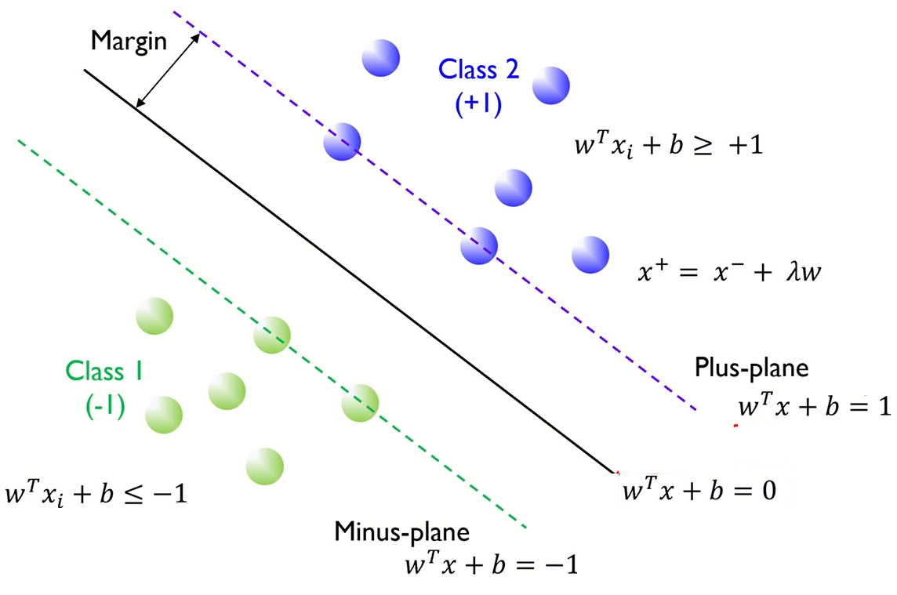

# Support Vector Machine(SVM)

아래의 그림에서 ① 분류기는 Train set을 틀리게 분류한다. 이를 여러번 학습시켜 모델링하면 ②와 ③ 분류기와 같이 될것이다. (여기서 분류기는 Hyperplane을 의미한다.)

Train set 측면에서 보면 ②와 ③ 분류기는 오류가 0이므로 같은 성능을 가진 분류기로 볼 수 있다. 하지만, 일반화(generalization) 측면에서 보면 ② 보다 ③이 더 낫다고 할 수 있다. 그 이유는 ③ 분류기가 두 개의 클래스에 대해 **여백**(margin) 크기 때문이다.

바로 여기서 이러한 여백, 즉 마진을 어떻게 공식화하고 이 마진을 최대화하는 결정 초평면(decision hyperplane)을 찾는 것이 바로 SVM의 발상이라 할 수 있다.

Margin을 최대화 한다
 = 일반화 오류 최소화
 = 좋은 성능

#### Margin
- Margin: 각 클래스에서 가장 가까운 관측치 사이의 거리
- Margin은 w(기울기)로 표현가능

## 2. 목적함수
다음과 같이 Margin은 각 기울기로 표현가능 하다. 두 클래스의 Margin을 최대화 하는 $\mathrm{w}^T + b+ =0$인 hyperplane을 찾는 것이 목적.

$\mathrm{w}^Tx^ + + b  = 1$ ($x^+$는 plus-plane 위의 점)

$\mathrm{w}^T(x^- + \lambda) + b = 1$  ( $x^+ = x^ + \lambda \mathrm{w}$)

$\mathrm{w}^Tx^- + b + \lambda \mathrm{w}^T\mathrm{w} = 1$

$-1 + \lambda \mathrm{w}^T w 1$ ($x^-$는 \minus-plane 위의 점)

$\lambda = \frac{2}{\mathrm{w}^Tw}$ ($w$는 찾고자 하는 hyperplane의 기울기)

### Norm(노름)

$$
\lVert W \rVert_p = (\sum_{i}{| x |^p})^{1/p}
$$

#### $L_2$ norm
$$
\lVert W \rVert_2 = (\sum_{i}{| w_i |^2})^{1/2} = \sqrt{w_1^2+w_2^2+ ... w_n^2} = \sqrt{\mathrm{w}^t\mathrm w}
$$

 

그러므로, 다음과 같은 Margin 식을 얻을 수 있다.
$$
Margin = distance(x^+, x^-) \\
= \lVert{x^+ - x^-}\rVert_2\\
= \lVert{( x^+ + \lambda w)+ - x^-}\rVert_2\\
= ||\lambda w||_2\\
= \lambda \sqrt{\mathrm{w}^tw}\\
= \frac{2}{\mathrm{w}^tw} * \sqrt{\mathrm{w}^tw}\\
= \frac{2}{\sqrt{\mathrm{w}^tw}} = \frac{2}{\rVert{w}\rVert_2}
$$

결론으로, $\frac{2}{\rVert{w}\rVert_2}$ 을 Margin을 최대화 하는 $\mathrm w$ 값을 찾고 싶은 것이다. 이는 다음 식으로 나타 낼 수 있다.

$$
\max. \  margin = \max\frac{2}{\rVert{w}\rVert_2} \Leftrightarrow \min\frac{1}{2}\rVert{w}\rVert_2
$$

w의 $l_2$ norm은 제곱근을 포함, 계산상의 편의를 위해 제곱 형태의 목적 함수를 변경 한다.

$$
\min\frac{1}{2}\rVert{w}\rVert_2 \Leftrightarrow \min\frac{1}{2}\rVert{w}\rVert_2^2
$$

위의 문제의 두 가지 측면에서 보면 다음과 같다.

- **해의 유일성(uniqueness)**
    - $\mathbf{w}$의 2차항만 가지므로 볼록(convex)한 함수이며, 조건식은 $n$개 모두 선형이다. 따라서, 유일한 해를 가진다.

- **문제의 난이도**
    - 위의 문제는 $n$개의 선형 부등식을 가진 2차함수의 최적화 문제이며, $n$의 개수는 엄청나게 클 수 있다. 이러한 경우에 **라그랑제 승수**(Lagrange multiplier)를 이용해 해결할 수 있다.

## Convex Optimization Problem

$$
\min \frac{1}{2}\lVert \mathrm{w} \rVert_2^2 \\
\text{s.t.} \  y_i (\mathrm{w}^Tx_i + b)≥1, i = 1,2,\ ...\ ..., n
$$

- Decision Variable은 W와 b
- Objective Function은 Separating hyperplane으로 부터 정의된 margin의 역수
- Constraint는 training data를 **완벽하게** seperating하는 조건
- Objective function은 quadratic이고, constraint 선형이다. $\leftarrow$ Quadratic Programming(QP)$\leftarrow$ Convex Optimization $\leftarrow$ 전역 최적해가 존재 한다.
- Training Data가 linearly separable한 경우에만 존재

## Lagrangian Formulation
라그랑주 승수를 이용하여 Lagrangian primal 문제로 변환 한다. 먼저, 간단한 예로 라그랑제 승수법을 살펴보도록 하자.

아래와 같이 **등식 제약**의 조건 하에서 함수 $f(x,y)$를 최소화 하는 $x,y$를 찾는 문제를 살표보면 다음과 같다.

$$
\min f(x,y) = x^2 + 2y \\
\text{s.t.} \ \  3x + 2y + 1 = 0
$$

위 식을 라그랑제 승수법을 사용하여 **라그랑제 함수**로 다음과 같이 정의가 가능하다.
$$
L(x,y,\alpha) = f(x,y) - \alpha(3x + 2y + 1 ) = x^2 + 2y - \alpha(3x + 2y + 1)
$$

$(\hat{x},\hat{y})$가 제약이 있는 최적화 문제의 해라면 $(\hat{x},\hat{y}, \hat{\alpha})$가  함수 $L(\cdot)$ 의 정류점(stationary point) 즉, 모든 편도함수(partial derivative)가 0인 지점이 되는 $\alpha$가 존재 한다는 것을 보였다.

따라서,$x,y,\alpha$ ​에 대한 라그랑지안 ​의 편도함수를 계산할 수 있으면 이 도함수가 모두 0이 되는 지점을 찾을 수 있고, 제약이 있는 최적화 문제의 해는 이런 정류점 중에 있어야 한다. 위의 식의 편도함수는 다음과 같다.
$$
\frac{\partial}{\partial x} L(x,y,\alpha) = 2x - 3\alpha \\
$$

$$
\frac{\partial}{\partial x} L(x,y,\alpha) = 2 - 2\alpha \\
$$

$$
\frac{\partial}{\partial x} L(x,y,\alpha) = -3x -2y -1
$$

위 식을 게산 하면, $\hat{x} = \frac{3}{2}, \hat{y} = \frac{11}{4}, \hat{\alpha} = 1$을 얻을 수 있다.

### 라그랑제 함수로 변환

위의 조건식에서 각 조건식 마다 라그랑제 승수 $\alpha_i$를 부여한다. 이들의 벡터를 $\mathbf{\alpha} = (\alpha_1, \dots , \alpha_n)^{T}$로 표기하자.

$$
L(\mathbf{w}, b, \mathbf{\alpha}) = \frac{1}{2} \| \mathbf{w} \|^{2} - \sum_{i=1}^{n}{\alpha_{i} \left( t_{i} \left( \mathbf{w}^{T} \mathbf{x}_{i} +b \right) -1 \right)}
$$

### Original Problem
$$
\min\frac{1}{2}\rVert{w}\rVert_2^2 \newline
subject\ to\ y_i(\mathrm{w}^TX_i + b) ≥ 1,\ i = 1,2,\ ...\ ...\ n
$$

### Lagrangian Primal
$$
\underset{a}{\max}\  \underset{\mathrm{w},b}{\min} \ L(\mathrm{w},b,a) = \min\frac{1}{2}\rVert{w}\rVert_2^2 - \sum_{i=1}^{n}a_i(y_i(\mathrm{w}^{T}x_i + b) -1 ) \\
subject\ to\ a_i ≥ 0,\ i = 1,2,\ ...\ ... \ ,n
$$
Convex, Continuous(연속형)이기 때문에 미분 = 0에서 최소 값을 갖는다.

1. $\frac{\partial L(\mathrm{w},b,a)}{\partial \mathrm{w}} = 0 \rightarrow w = \sum_{i=0}^{n}a_iy_ix_i$
2. $\frac{\partial L(\mathrm{w},b,a)}{\partial \mathrm{b}} = 0 \rightarrow \sum_{i=0}^{n}a_iy_i = 0$

### Lagrangian Formulation

#### 1. $\min\frac{1}{2}\rVert{w}\rVert_2^2$
$$
\min\frac{1}{2}\rVert{w}\rVert_2^2 = \frac{1}{2}\mathrm{w^Tw} \\
= \frac{1}{2}\mathrm{w}^T \sum_j=1^n a_jy_jx_j
= \frac{1}{2}\sum_j=1^na-Jy_j(\mathrm^Tx_j)
= \frac{1}{2}\sum_j=1^na-Jy_j(sum_i=1^na-Jy_jx_i^Tx_j)
= \frac{1}{2}

$$

## Reference
- [서포트 벡터 머신 (Support Vector Machine) · ratsgo's blog](https://ratsgo.github.io/machine%20learning/2017/05/23/SVM/)

- [(3) [핵심 머신러닝] SVM 모델 1 (Margin, Hard Margin Linear SVM) - YouTube](https://www.youtube.com/watch?v=qFg8cDnqYCI)

